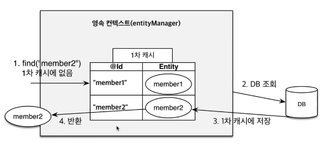
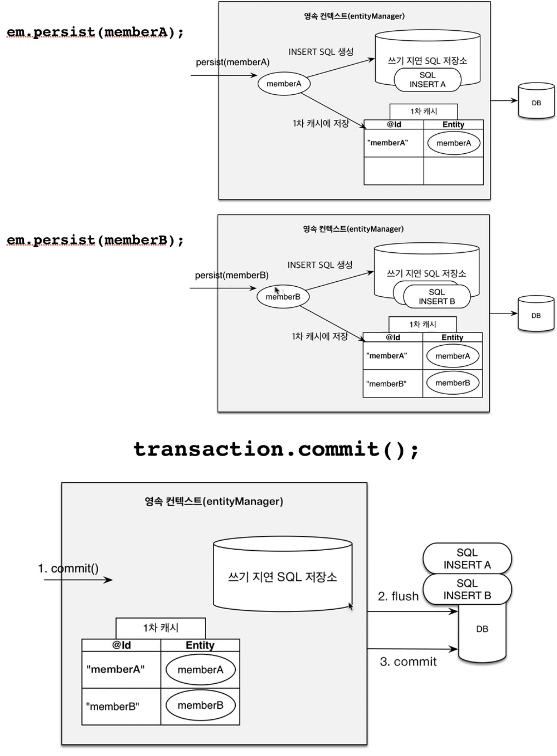
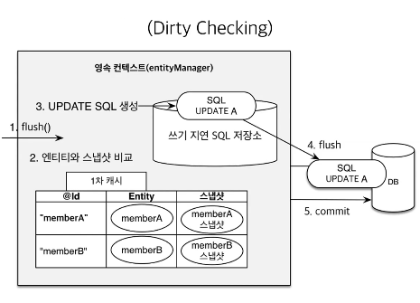

JPA 핵심 - 영속성 컨텍스트
====================

`EntityManagerFactory`를 통해 각각의 고객의 요청이 올 때 마다    
각각의 `EntityManager`를 생성한다.
* `EntityManager`는 내부적으로 `DB Connection`을 사용해 DB를 사용한다.
* `EntityManager`는 내부적으로 영속성 컨텍스트가 존재한다.
  > 즉, `EntityManager`를 통해 영속성 컨택스트에 접근한다. 
 
##영속성 컨텍스트
* 엔티티를 영구 저장 / 관리하는 환경    
```EntityManager.persist(entity);``` : entity가 영속성 컨텍스트에 persist 된다.
> 존속하다: continue, maintain / 지속하다: continue, persistent    
> 늬앙스는 존속-지속 되는, 즉, 영속성 컨텍스트에 속해 관리되는 것. 

## 영속성 컨텍스트의 특징
* 1차 캐시로 인한 성능 이점    

  > 있으면 주고, 없으면 찾아서 등록 후 주고. 일반적인 캐시와 같다.    
  > 그러나 1차 캐시는 한 트랜젝션 안에서만 유효하므로 성능적 이점보단 다음의 이점이 크다.

* 영속 엔티티의 동일성 보장
    ```java
    Member m1 = entityManager.find(Member.class, "m1");
    Member m2 = entityManager.find(Member.class, "m2");
    
    System.out.println(a == b); // true
    ```
    1차 캐시로 인해 Repeatable read 등급의 트랜잭션 격리 수준을 애플리케이션 차원에서 제공가능하다.


* 트랜잭션을 지원하는 쓰기 지연    
  
  > 영속성 컨텍스트는 `쓰기 지연 SQL 저장소`가 있다.     
  > 이곳에 `persist로 생성된 DML`이 쌓이고 commit시에 DB에 `batch단위로 commit`한다.


* 엔티티 Dirty Checking
  ```java
  EntityManager em = emf.createEntitymanager();
  EntityTransaction transaction = em.getTransaction();
  
  // 트랜잭션 시작
  transaction.begin();
  
  // 영속 엔티티 조회
  // find()시에 넘겨준 entity의 스냅샷이 생성된다.
  Member memberA = em.find(Member.class, "memberA");
  
  // 받은 영속 엔티티 수정
  memberA.setUsername("m1");
  memberA.setAget(10);
  
  // 해당 코드는 커밋시에 
  // find()시 만들어놓은 스냅샷과 비교하여 
  // 자동 변경 후 반영하기에 필요가 없다.
  // em.persist(member);
          
  // 트랜잭션 커밋
  transaction.commit();
  ```
  
  > 간단히 JPA는 컬렉션을 사용하는 것 처럼 사용하면 된다.
  

## flush
  * 영속성 컨택스트의 변경 내용을 DB에 동기화
  * 직접 호출가능하다. -> entityManager.flush();

## 준영속 상태
  * 더이상 영속성 컨택스트에서 관리되지 않는 상태 / 객체    
  사용 방법:
    * `entityManger.detach(entity); // entity를 관리하지 않음 - 즉, 1차 cache에서도 사라짐`
    * `entityManager.clear();  // 영속성 컨택스트 자체를 비움`