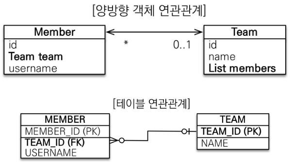

연관 관계 매핑
===========
## 객체 관계와 테이블 연관관계
* DB, ORM은 공통적으로 1:1, 1:N, N:M의 관계가 있다.
* DB에서는 단방향 연관관계가 없다.
    > FK로 join이 가능하기에 양쪽의 길이 열여있다 라고 생각하면 된다.
* 객체 관계에서 위의 관계를 표현하려면 A.getB(), B.getA()라는 2가지의 참조로 만들어진다.     
  그러나 DB는 FK라는 1개의 참조로 양방향 접근이 가능하다.
    > DB에서는 FK가 자연스럽게 참조하는 쪽이`주` 이지만, 객체에선 2가지의 참조가 가능하므로 딜레마이다.
* 객체에서의 `주`는 어느 쪽이던 상관 없지만, DB에서 FK는 N에 붙고, N 테이블이 `주`임을 고려해보면,    
    객체에서도 **N쪽을 `주`로 잡는편이 여러모로 편하다.**
    > 편하다고 했지만 이후에 심각한 버그나 성능 이슈에 대비 가능하므로 사실상 권장된다.    
        그리고 `종`입장에서 `주 필드변수`의 직접수정은 **DB에 반영이 되지 않는다.** (DB에 반영 안될 뿐이지 1차 캐시에는 반영된다.)    
        즉, 양쪽에 값을 설정해줘야 한다.(`주`의 setter나 setAndChange() 하는것을 추천)

## 코드

```java
import javax.persistence.*;
import java.util.ArrayList;

// N - 주 객체
@Entity
class Member {
    @Id
    @GeneratedValue
    private Long id;

    @ManyToOne // Many = Member, One = Team
    @JoinColumn(name = "TEAM_ID") // 주 객체에서 join한다. 사실상 DB입장에서는 이게 FK이기 때문에 Join가능함을 JPA에 알려준다.
    private Team team;
    
    public void setTeam(Team team) {
        this.team = team;
        
        // 해당 코드는 DB에는 의미 없는 코드지만, 1차 캐시 입장에서는 의미가 있다.
        // 해당 코드없이 바로 team->member로 값을 찾을경우 
        // 1차 캐시에 team->member는 empty이다.
        // 이 코드를 넣지 않으면 매번 flush(), clear()를 호출해줘야 한다.
        team.getMemberList().add(this);
    }
    //...
}

// 1 - 종 객체
@Entity
class Team {
    @Id
    @GeneratedValue
    private Long id;

    @OneToMany(mappedBy = "team") // 주 객체가 team이다. 이 필드는 읽기 전용이다.
    List<Member> memberList = new ArrayList<>();
    
    //...
} 

public class Main {
    public static void main(String[] args) {
        EntityManagerFactory emf = Persistence.createEntityManagerFactory("name");

        EntityManager em = emf.createEntityManager();
        EntityTransaction transaction = em.getTransaction();

        transaction.begin();

        try {
            
            Team team = new Team();
            em.persist(team);
            
            Member member = new Member();
            
            // 당연히 주 객체에서 FK를 넣어줘야한다.
            // 객체는 DB와 다르게 양방향 관계를 서로를 참조하는 2가지 참조값으로 표현하지만,
            // 우리는 주 쪽(N)이 FK를 가지기로 했으므로 member에 FK를 설정해준다.
            member.setTeam(team);
            em.persist(member);
            
            transaction.commit();
            
        } catch (Exception e) {
            transaction.rollback();
        } finally {
            em.close();
        }

        emf.close();
    }
}
```

