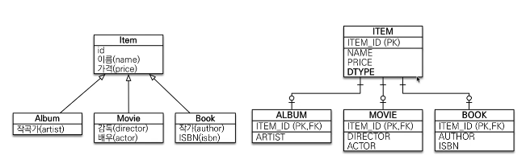
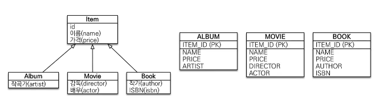
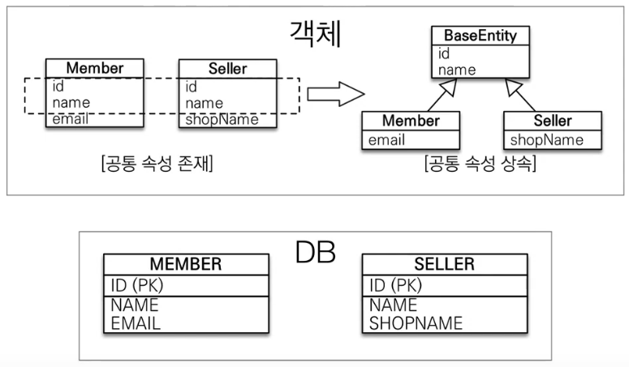

상속 관계 매핑
===========
상속 관계의 논리 모델을 실제 물리 모델로 구현 시 할 수 있는 방법

## 1. 조인 전략(각각 테이블로 변환)
   
   * 부모 클래스에 `@Inheritance(strategy = IngeritanceType.JOINED)` 사용
   * 부모 클래스에 `@DiscriminatorColumn`을 붙이면 자식 엔티티의 이름을 가지는 DTYPE 속성을 추가한다. 
        * 필요하다면 자식 클래스에 `DiscriminatorValue("이름")`을 통해 DTYPE 이름을 변경 가능하다.
        * 안써도 되지만, 직접 DB 조회시 어떤 자식 엔티티 때문에 부모 엔티티에 값이 들어왔는지 쉽게 알 수 있기에 많이들 추가한다.
   
### 특징  
   * 각각 테이블에 insert를 한다.
   * join을 통해 조회를 한다.

### 코드
```java
@Entity
@Inheritance(strategy = InheritanceType.JOINED)
@DiscriminatorColumn
public class Item {
     @Id @GeneratedValue
     private Long id;
     private Stirng name;
     private int price;
}

@Entity
@DiscriminatorValue("원하는 다른 DTYPE 이름")
public class Album extends Item {
    private String artist;
}


```
## 2. 단일 테이블 전략(통합 테이블로 변환)
   
   * 부모 테이블에 `@Inheritance(strategy = IngeritanceType.SINGLE_TABLE)`를 붙이거나 생략한다.
   * `DiscriminatorColumn`을 붙이거나 생략한다.
   * 즉 아무런 에노테이션을 붙이지 않아도 된다.
   
### 특징
   * 엔티티를 그냥 상속해 사용하면 (단일 테이블로)동작하는 JPA 기본전략
   * 한 테이블(부모)에 때려넣고 DTYPE을 통해 구분한다
   * 성능이 좋다.
   * null을 허용한다. (다른 자식 테이블의 속성이 null로 들어감)

### 코드
```java

// @Inheritance(strategy = InheritanceType.SINGLE_TABLE)
// @DiscriminatorColumn
@Entity
public class Item {
    @Id @GeneratedValue
    private Long id;
    private Stirng name;
    private int price;
}

// @DiscriminatorValue("원하는 다른 DTYPE 이름")
@Entity
public class Album extends Item {
    private String artist;
}


```
## 3. 서브타입 테이블로 변환(구현 클래스마다 각각 테이블로 변환)
   
   * 부모 타입으로 조회 할 때 id만 알 경우 모든 테이블을 모두 뒤진다.
   * 사용하지 않는다.

### 참고
* 기본으로 조인 전략을 사용한다. 상황에 따라 단일 테이블 전략을 사용한다.(단순한 테이블, 확장이나 변경하지 않을 테이블)

Mapped Superclass - 매핑정보 상속
===============================


* 공통 매핑정보가 필요 할 시 사용 (속성만 끌어다 쓸 때)
* DB는 그림처럼 각각의 테이블을 두지만, 객체입장에서 속성만 상속 받아 사용하고 싶을 때 사용.
* **상속관계 매핑 개념이 아니다**, 엔티티가 아니므로 em.find()로 찾을 수 없으며 존재 하지도 않는다.(부모 타입으로 조회 안된다는 의미)
* 추상 클래스로 만들길 권장.

```java
import javax.persistence.Column;

// 테이블 정보를 위해 객체에 해당 정보가 공통으로 필요한 상황
// 해당 super class 를 상속 받아 사용하기만 하면 됨
@Getter
@Setter
@MappedSuperclass   // 이것 만 넣어주면 된다.
public abstract class BaseEntity {
     @Column(name = "사용가능")
     private String lastModifiedBy;
     private LocalDateTime lastModifiedDate;
}

@Entity
public class Entity extends BaseEntity {
    private String name;
}
```