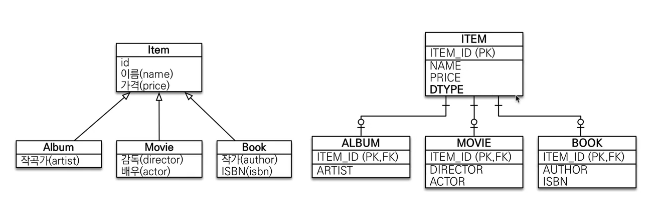
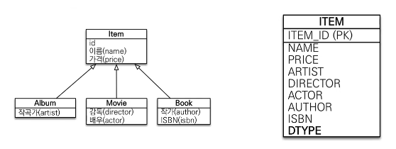
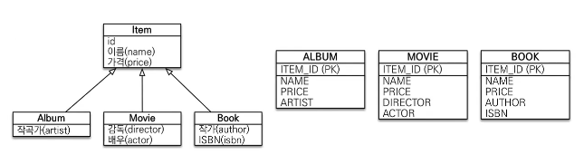
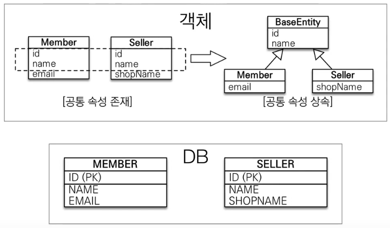

상속 관계 매핑
===========
상속 관계의 논리 모델을 실제 물리 모델로 구현 시 할 수 있는 방법

## 1. 조인 전략(각각 테이블로 변환)
   
   * 부모 클래스에 `@Inheritance(strategy = IngeritanceType.JOINED)` 사용
   * 부모 클래스에`DiscriminatorColumn`을 붙여 DTYPE에 하위 클래스의 이름을 사용한다.
        * 필요하다면 자식 클래스에 `DiscriminatorValue("이름")`을 통해 DTYPE을 변경 가능하다.
   * 각각 테이블에 insert를 한다.
   * join을 통해 조회를 한다.
   * DTYPE을 통해 구분한다.

## 2. 단일 테이블 전략(통합 테이블로 변환)
   
   * `DiscriminatorColumn`을 사용하지 않아도 DTYPE을 자동생성한다.
   * 부모 테이블에 `@Inheritance(strategy = IngeritanceType.SINGLE_TABLE)`만 붙이면 된다. 
   * DTYPE을 통해 구분한다
   * 성능이 좋다.
   * JPA 기본전략
   * null을 허용한다.
### 3. 서브타입 테이블로 변환(구현 클래스마다 각각 테이블로 변환)
   
   * 부모 타입으로 조회 할 때 id만 알 경우 모든 테이블을 모두 뒤진다.
   * 사용하지 않는다.

### 참고
* 기본으로 조인 전략을 사용한다. 상황에 따라 단일 테이블 전략을 사용한다.(단순한 테이블, 확장이나 변경하지 않을 테이블)

## Mapped Superclass - 매핑정보 상속

* 공통 매핑정보가 필요 할 시 사용
* DB는 그림처럼 각각의 테이블을 두지만, 객체입장에서 속성만 상속 받아 사용하고 싶을 때 사용.
  