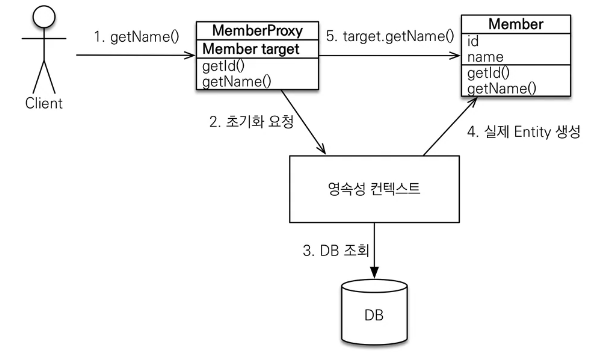

프록시
=====
## 기초
entityManager.find(): DB를 통해실제 엔티티 객체를 조회    
entityManger.getReference(): DB조회를 미루는 목 오브젝트(프록시)를 조회    


## 특징
* 프록시 객체는 실제 사용시 때만 한번만 초기화한다.
* 초기화 될 때, 프록시 객체가 실제 엔티티로 바뀌는게 아니라,    
  프록시 객체 내부의 참조값을 통해 **실제 엔티티에 접근하는 것**.
  * 프록시 객체는 원본 엔티티를 상속 받기에 타입체크시 `==`이 아닌`instance of`를 사용해야한다.
  
* 영속성 컨텍스트에 찾으려는 엔티티가 있으면, `entityManager.getReference()`를 해도 실제 객체가 넘어온다.

  > 위의 특징들은 한 트랜젝션 안에서는 JPA를 통해 컬랙션을 사용하듯 같은 객체임을 보장해줘야하기 때문이다.    
  > 예로 프록시 객체로 조회 후 초기화한 객체 A를 find(class, A.getId())를 하면 똑같은(==이 true인)프록시 객체가 넘어온다.
* 영속성 컨텍스트가 종료됐거나, em.detach(Entity)를 한 이후 초기화를 요청하면     
  `org.hibernate.LazyInitializationExcpetion`이 발생한다.
  
## 지연 로딩
연관관계를 프록시를 이용해 접근 시점에 로딩한다.
* 예로 Member를 조회했을 때 Team을 잘 사용하지 않을경우 사용가능.
* `@ManyToOne`, `@OnetoOne` fectch의 기본설정.

### 문제점
* JPQL에서 N + 1문제를 일으킴(1개의 쿼리가 N개의 추가 쿼리를 던짐)
  * 이후에 fetch join으로 해결 가능
```java
public class Member {
    
    // Member.getTeam().getName() 와 같이 DB를 실제 조회시 로딩한다.
    @ManyToOne(fetch = FetchType.LAZY)
    private Team team;    
  // ...
}
```

## 즉시 로딩(권장하지 않음)
연관관계를 한 쿼리에 같이(Join) 조회한다.
* 예로 Member를 조회했을 때 Team을 거의 자주 사용 할 경우 사용가능.
```java
public class Member {
    
    // Member.getTeam().getName() 와 같이 DB를 실제 조회시 로딩한다.
    @ManyToOne(fetch = FetchType.EAGER)
    private Team team;    
  // ...
}
```

## 정리
* 모든 연관관계는 지연 로딩을 사용해야함.
* 실무에서 즉시로딩을 사용하지 않는다.