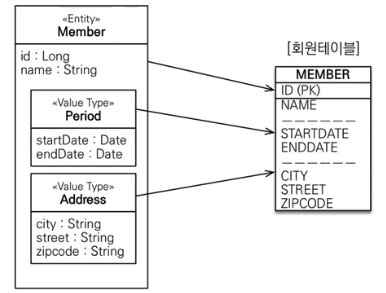
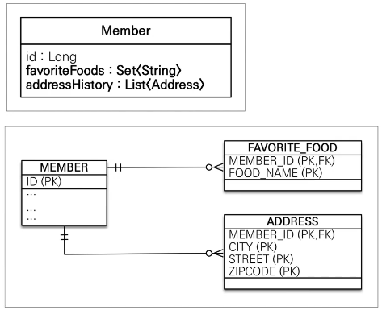

JPA 타입
=========
## 분류
* [엔티티 타입]()
* [값 타입]()
  * [기본 값 타입]()
    * JAVA 기본타입, 래퍼 클래스, String
  * [임베디드 타입(복합 타입)]()    
  * [컬렉션 값 타입]()
    * [컬렉션 + 기본 값 타입]()
    * [컬렉션 + 임베디드 타입]()
    
* [컬렉션 값 타입의 실사용]()

## [엔티티 타입]() 
* @Entity로 정의하는 식별자로 추적가능한 객체

## [값 타입]()
* @Entity를 붙이지 않는 모든 타입.    
* 단순 하면서 추적 필요성이 없는 객체에만 값 타입 컬렉션을 사용한다.

### 특징
* 식별자 없음 - 값이 변경되면 추적 불가
* **값 타입을 가진 엔티티의 라이프사이클에 맞춰진다.** 
  * 즉, 따로 persist, commit 할 필요가 없다.
* 공유하지 않는것이 안전 - 불변 객체로 만드는 것이 낫다.

## [임베디드 타입 (복합값 타입)]()

* 좌표같은 x, y값 들을 타입으로 묶음
* 임베디드 클래스에 `@Embeddable`, 사용 필드에 `@Embedded` 로 사용가능

### 특징 
* 테이블 변화 없이 객체지향 적으로 매핑 가능
* 재사용 및 높은 응집도
* 해당 타입을 사용하는 의미있는 메소드를 작성가능
* 값타입, 임베디드 타입을 소유한 **엔티티에 생명주기가 맞춰짐**
* **사용 전 후 테이블 변화 없음**
### 코드

```java
import javax.persistence.AttributeOverride;
import javax.persistence.AttributeOverrides;
import javax.persistence.Column;
import javax.persistence.Embedded;

@Getter
@Setter
@Embeddable
public class Period {
  private LocalDateTime startDate;
  private LocalDateTime endDate;
}

@Entity
public class Entity {
  @Id
  @GeneratedValue
  private Long id;

  @Embedded // 생략가능 but 붙이는 것을 권장
  private Period sinceWorkingPeriod;

  @Embedded
  @AttributeOverrides({ // 한 테이블에 임베디드 타입을 2개 이상 쓰면 같은 속성이 중복 되기에 
                        // 필드명과 테이블 속성명을 각각 매핑해주면 된다. 
          @AttributeOverride(name = "startDate", column = @Column(name = "TODAY_START")),
          @AttributeOverride(name = "endDate", column = @Column(name = "TODAY_END"))
  })
  private Period todayWorkingPeriod;
}
```
## [컬렉션 값 타입]()
* `@ElementCollection`, `@CollectionTable` 사용
* DB에 컬렉션을 저장 할 수 없으므로 별도의 테이블을 생성함
* 지연 로딩이 기본
* 복합 값 타입의 컬렉션은 update시에 **해당 타입 자체를 교체해야한다.**

### [컬렉션 + 기본 값 타입]()

### [컬렉션 + 임베디드 타입]()


### 코드


```java
@Entity
@Setter
@Getter
public class Member {

    @Id
    @GeneratedValue
    @Column(name = "MEMBER_ID")
    private Long id;

    // 컬렉션 + 기본 값 타입
    @ElementCollection
    @CollectionTable(name = "FAVORITE_FOODS",
            joinColumns = @JoinColumn(name = "MEMBER_ID"))    // 테이블 매핑 정보
    @Column(name = "FOOD_NAME") // 기본 값 하나를 컬렉션으로 가지기에 이름을 정해줘야 하므로 예외적으로 @Column으로 이름을 정의 가능.
    private Set<String> favoriteFoods = new HashSet<>();

    // 컬렉션 + 임베디드 값 타입
    @ElementCollection
    @CollectionTable(name = "ADDRESS",
            joinColumns = @JoinColumn(name = "MEMBER_ID"))
    private List<Address> addressHistory = new ArrayList<>();
}

// @Setter - 막는것이 좋음
@Getter
@Embeddable
public class Address {
    private String city;
    private String street;
    private String zipcode;

    private Address() {
    }

    public Address(String city, String street, String zipcode) {
        this.city = city;
        this.street = street;
        this.zipcode = zipcode;
    }

    @Override
    public boolean equals(Object o) {
        if (this == o) return true;
        if (o == null || getClass() != o.getClass()) return false;
        Address address = (Address) o;
        return Objects.equals(getCity(), address.getCity()) && Objects.equals(getStreet(), address.getStreet()) && Objects.equals(getZipcode(), address.getZipcode());
    }

    @Override
    public int hashCode() {
        // 프록시 객체일 경우를 고려해 getter를 사용 && 권장되는 방법
        return Objects.hash(getCity(), getStreet(), getZipcode());
    }
}

public class Main {
    public static void main(String[] args) {
        EntityManagerFactory emf = Persistence.createEntityManagerFactory("jpa");
        EntityManager em = emf.createEntityManager();
        EntityTransaction transaction = em.getTransaction();
        transaction.begin();

        try {
            Member member = new Member();

            // ========= insert =========
            // 컬렉션 + 기본 값 insert
            member.setFavoriteFoods("치킨");
            member.setFavoriteFoods("피자");

            // 컬렉션 + 임베디드 값 insert
            member.setAddressHistory(new Address("h1", "st1", "000"));
            member.setAddressHistory(new Address("h2", "st2", "001"));

            // 값 타입의 라이프 사이클은 member에 종속적 즉, member만 persist 하면 된다.
            em.persist(member);

            em.flush();
            em.clear();

            // ========= update =========
            Member foundMember = em.find(Member.class, member.getId());
            
            // 컬렉션 + 기본 값 update
            foundMember.getFavoriteFoods().remove("치킨");    // 쿼리나감
            foundMember.getFavoriteFoods().add("족발");       // 쿼리나감
            
            // 컬렉션 + 임베디드 값 update
            // h1 -> h3
            // equals(), hashcode() 를 정확히 구현해야함
            // 찾은 member.id의 모든 address를 지우고(h1, h2) h2, h3를 insert함
            // @OrderColumn을 추가하면 id + order을 pk로 해 위와같이 동작하지 않지만 복잡해진다.
            foundMember.getAddressHistory().remove(new Address("h1", "st1", "000"));    // 쿼리나감
            foundMember.getAddressHistory().add(new Address("h3", "st1", "000"));       // 쿼리나감
            
            transaction.commit();
        } catch (Exception e) {
            transaction.rollback();
        } finally {
            em.close();
        }
        emf.close();
    }
}
```

## [컬렉션 값 타입의 실사용]()
* 직접 사용하는 것 보단 1:N 관계로하는 **래핑 엔티티**를 만드는것을 권장
* 컬렉션이나 여러 조건에 따라 기본키를 식별 가능, 불가능 할 수있으므로     
  JPA는 최악의 경우인 모두 삭제 후 insert 전략을 사용한다.    
  그래서 래핑 엔티티를 사용하는게 여러모로 편한것이다.
  * 1:N 관계를 위한 엔티티를 만들고, 여기에 값타입을 사용
  * 사용시에는 Cascade + 고아 객체 제거를 함께 사용

```java
import jpabook1.jpashop.domain.Address;
import lombok.Getter;
import lombok.Setter;

import javax.management.ConstructorParameters;
import javax.persistence.Entity;
import javax.persistence.GeneratedValue;
import javax.persistence.Id;
import javax.persistence.Table;
import java.util.ArrayList;

// 컬렉션 + 값 타입을 사용하는 래퍼 엔티티
@Entity
@Getter
@Setter
@ConstructorParameters()
@Table(name = "ADDRESS")
public class AddressEntity {
  @Id
  @GeneratedValue
  private Long id;

  private Address address;
}

@Entity
@Setter
@Getter
public class Member {

  @Id
  @GeneratedValue
  @Column(name = "MEMBER_ID")
  private Long id;

  // 컬렉션 + 기본 값 타입
  // set은 자료구조 자체가 유일성을 보장해 pk판별 가능. 전제 delete, insert가 발생하지 않는다.
  @ElementCollection
  @CollectionTable(name = "FAVORITE_FOODS",
          joinColumns = @JoinColumn(name = "MEMBER_ID"))    // 테이블 매핑 정보
  @Column(name = "FOOD_NAME") // 기본 값 하나를 컬렉션으로 가지기에 이름을 정해줘야 하므로 예외적으로 @Column으로 이름을 정의 가능.
  private Set<String> favoriteFoods = new HashSet<>();

  // 컬렉션 + 임베디드 값 타입
//    @ElementCollection
//    @CollectionTable(name = "ADDRESS",
//            joinColumns = @JoinColumn(name = "MEMBER_ID"))
//    private List<Address> addressHistory = new ArrayList<>();

  // 여기서는 단방향 매핑을 사용했음. 필요에 따라 양방향 사용.
  // join key가 다른 테이블에 있기에 update 쿼리가 나가지만 이 방법이 더 나음
  @OneToMany(cascade = CascadeType.ALL, orphanRemoval = true)
  @JoinColumn(name = 'MEMBER_ID')
  private List<AddressEntity> addressHistory = new ArrayList<>();
}

public class Main {
  public static void main(String[] args) {
    EntityManagerFactory emf = Persistence.createEntityManagerFactory("jpa");
    EntityManager em = emf.createEntityManager();
    EntityTransaction transaction = em.getTransaction();
    transaction.begin();

    try {
      Member member = new Member();

      // ========= insert =========
      // 컬렉션 + 기본 값 insert
      member.setFavoriteFoods("치킨");
      member.setFavoriteFoods("피자");

      // 컬렉션 + 임베디드 값 insert
//      member.setAddressHistory(new Address("h1", "st1", "000"));
//      member.setAddressHistory(new Address("h2", "st2", "001"));
      member.setAddressHistory(new AddressEntity("h1", "st1", "000"));
      member.setAddressHistory(new AddressEntity("h2", "st2", "001"));

      // 값 타입의 라이프 사이클은 member에 종속적 즉, member만 persist 하면 된다.
      em.persist(member);

      em.flush();
      em.clear();

      // ========= update =========
      Member foundMember = em.find(Member.class, member.getId());

      // 컬렉션 + 기본 값 update
      foundMember.getFavoriteFoods().remove("치킨");    // 쿼리나감
      foundMember.getFavoriteFoods().add("족발");       // 쿼리나감

      // 컬렉션 + 임베디드 값 update
      // h1 -> h3
      // equals(), hashcode() 를 정확히 구현해야함
//      foundMember.getAddressHistory().remove(new Address("h1", "st1", "000"));    // 쿼리나감
//      foundMember.getAddressHistory().add(new Address("h3", "st1", "000"));       // 쿼리나감
      foundMember.getAddressHistory().remove(new AddressEntity("h1", "st1", "000"));    // 쿼리나감
      foundMember.getAddressHistory().add(new AddressEntity("h3", "st1", "000"));       // 쿼리나감
      

      transaction.commit();
    } catch (Exception e) {
      transaction.rollback();
    } finally {
      em.close();
    }
    emf.close();
  }
}
```
  

