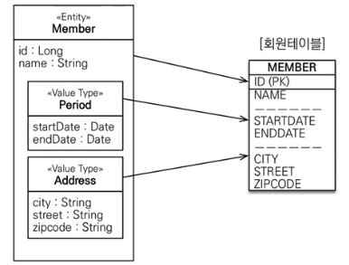

기본값 타입
=========
## 엔티티 타입
* @Entity로 정의하는 식별자로 추적가능한 객체

## 값 타입
###기본값 타입
  JAVA에서 제공하는 기본타입
### 임베디드 타입
  * 복합값 타입    
  
    * 테이블 변화 없이 객체지향 적으로 매핑 가능
    * 임베디드 클래스에 `@Embeddable`, 사용 필드에 `@Embedded` 로 사용가능
### 컬렉션 타입
  추가예정

[comment]: <> (  * 값타입 컬렉션은 모든 필드의 값들을 PK로 잡아야한다. 별도의 PK를 만든다면 그것은 엔티티가 돼버리기 때문.)

[comment]: <> (  * DB에 컬렉션 타입을 저장 할 수 없으므로 1:N으로 별도의 테이블을 만들어 JOIN하는 것 이다.)

[comment]: <> (    * 테이블이 달라도 라이프 사이클이 같게 동작한다.)
  

## 사용
### 값 타입
단순 하면서 추적 필요성이 없는 객체에만 값 타입 컬렉션을 사용한다.
* 식별자 없음
* 생명 주기를 엔티티에 의존
* 공유하지 않는것이 안전 - 불변 객체로 만드는 것이 낫다.

### 값 타입 컬렉션
* 이것을 사용하는 것 보단 1:N 관계를 고려
  * 1:N 관계를 위한 엔티티를 만들고, 여기에 값타입을 사용
  * 사용시에는 Cascade + 고아 객체 제거를 함께 사용
  

